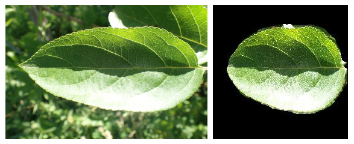

# leaf-segmentation-unet
a unet model trained for the semantic segmentation of leaf images

## folder structure

```
.
├── dataset
│   └── note.md
├── LICENSE
├── model
│   ├── __init__.py
│   ├── model.py
│   └── pretrained
│       └── download.md
├── predict.py
├── preprocess
│   ├── generate_dataset.py
│   ├── __init__.py
│   └── README.md
├── README.md
├── requirements.txt
├── static
├── train.py
└── utilities
    └── utility.py
```
#### output samples



> input images are from the dataset of [Plant Pathology 2021 Challenge](https://www.kaggle.com/c/plant-pathology-2021-fgvc8)


## instructions

### train from scratch

* prepare dataset
    * cd into `./preprocess`
    * download `DenseLeaves.zip` using the command:
    ```bash
    wget -c https://www.egr.msu.edu/denseleaves/Data/DenseLeaves.zip
    ```
    * unzip
    ```bash
    unzip -o ./DenseLeaves.zip
    ```
    * run `python generate_dataset.py`

    The newly processed dataset is now saved at `./dataset`

* cd back to project root and run `python train.py` to train the model

When training, the model saves the weights in the `./model/pretrained` model.
* `latest_weights.pth` - weights saved at the end of the last epoch
* `best_val_weights.pth` - weights saved when the model obtained minimum validation loss

### use pretrained (prediction)

coming soon

### acknowledgement

* DenseLeaves dataset - Michigan State University [visit](https://www.egr.msu.edu/denseleaves/)

### update log
2021-06-24: first code upload, most of the code is really bad (I wrote them a while ago). I shall refactor them soon.
