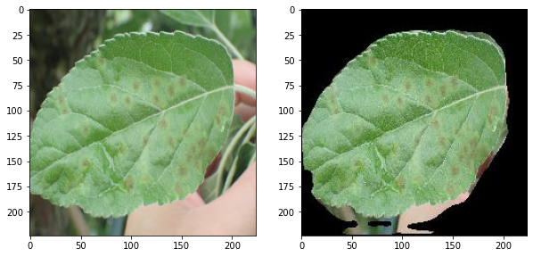
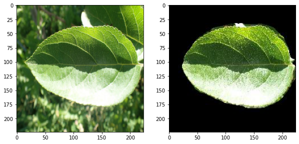

# leaf-segmentation-unet
<p>
    
    
</p>

a unet model trained for the semantic segmentation of leaf images

## folder structure

```
.
├── dataset
│   └── note.md
├── model
│   ├── pretrained
│   │   └── download.md
│   ├── __init__.py
│   └── model.py
├── preprocess
│   ├── generate_dataset.py
│   ├── __init__.py
│   └── README.md
├── test
│   └── get_testset.sh
├── utilities
│   ├── __init__.py
│   └── utility.py
├── get_dataset.sh
├── get_pretrained.sh
├── LICENSE
├── predict.py
├── README.md
├── requirements.txt
└── train.py
```
#### output samples



> input images are from the dataset of [Plant Pathology 2021 Challenge](https://www.kaggle.com/c/plant-pathology-2021-fgvc8)

## instructions

### train from scratch

* prepare dataset

    linux users can run `get_dataset.sh` instead of first three steps
    1. cd into `./preprocess`
    1. download `DenseLeaves.zip` from [here](https://www.egr.msu.edu/denseleaves/Data/DenseLeaves.zip)
    1. unzip the downloaded file as `./preprocess/DenseLeaves/`

    1. run `python generate_dataset.py`

    The newly processed dataset is now saved at `./dataset`

* cd back to project root and run `python train.py` to train the model

When training, the model saves the weights in the `./model/pretrained` model.
* `latest_weights.pth` - weights saved at the end of the last epoch
* `best_val_weights.pth` - weights saved when the model obtained minimum validation loss

### use pretrained (prediction)

* download pretrained weights

linux users can run `get_pretrained.sh` (make sure `gdown` is installed -- `pip install gdown`)

others can download the weights from links provided in this [file](./model/pretrained/download.md)

* specify test image location

edit the `TEST_DIR` variable in `predict.py` to specify custom images or download a sample dataset by running `get_testset.sh` in `./test` folder.

> **tip**: if the segmentation results are not satisfactory, modify the mask threshold values in `predict.py` file
### acknowledgement

* DenseLeaves dataset - Michigan State University [visit](https://www.egr.msu.edu/denseleaves/)
* Plant Pathology 2021 dataset - Kaggle

### update log
2021-06-24: first code upload, most of the code is really bad (I wrote them a while ago). I shall refactor them soon.
